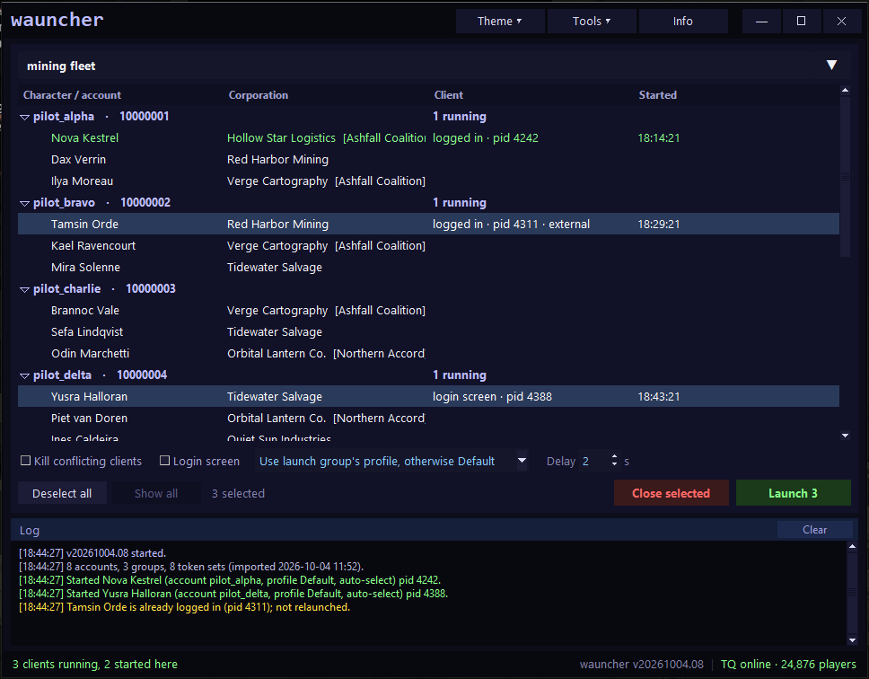

# wauncher

A small third-party launcher for EVE Online. It reads your accounts, characters, launch groups and
refresh tokens from the official EVE launcher, then starts game clients itself, the same way the official
launcher does: one OAuth refresh call to CCP's SSO per account, then `exefile.exe` with the official
launcher's argument set. Nothing else is touched.



*(screenshot uses invented accounts and characters)*

## What it does

- **Accounts and characters** in one list, characters grouped under their account. Drag rows to re-arrange
  (accounts among accounts, characters within their account); the order is remembered.
- **Search bar**: type to auto-complete characters, account names or launch groups. Click the `▾` to list the
  launch groups alphabetically, headed by *running clients (N)*, which selects every row with a running
  client. Picking a group shows only that group's accounts and selects its members (*Show all* brings the
  rest back); picking a character or account selects that. *Deselect all* clears the selection.
- **Launch** starts every selected character (or an account's active character when an account row is
  selected). Double-click a character to launch just that one. A delay runs between clients. Before
  launching, the installed client build (`tq\start.ini`) is compared with Tranquility's server version from
  ESI; on a mismatch you are warned that the client probably needs the official launcher to update it, and
  can launch anyway or cancel. *Close selected* is only enabled when a selected account has a running client.
- **Options**
  - *Kill conflicting clients*: a client already running for the same account is closed first. Hover the
    checkbox to see which clients that would be for the current selection. When it is off, accounts that
    already have a live client are skipped (and said so in the log); an account whose client has died is
    started again. A character that is already logged in (per its client window title) is never relaunched
    either way; double-clicking it brings its client to the front instead.
  - *Login screen*: start without `/autoSelectCharacter`, so the client stops at the character screen.
  - *Settings profile* dropdown: *Use launch group's profile, otherwise Default*, *Use Default settings
    profile*, or *Force <profile>* for any of the client settings profiles found on this machine (the
    `settings_<name>` folders under `%LOCALAPPDATA%\CCP\EVE\c_ccp_eve_tq_tranquility`, alphabetical).
- **Running clients are recognised from their command line**, the way the official launcher does it: the
  account id comes from `/LauncherData` or the ssoToken, the character from `/autoSelectCharacter`, the
  profile from `/settingsprofile`. That identifies every `exefile.exe` the moment it exists, including
  clients the official launcher started (shown as *external*); the window title is only used to tell
  "logged in" from "login screen". Clients wauncher started are also recorded with process id and creation
  time in `launched.json`.
- **Server status** in the status bar, from ESI (`/latest/status/`): online or offline, player count, VIP.
  Polled every 30 s, and every 5 s between 11:00 and 11:30 UTC until Tranquility is back after downtime.
  Hover it for version and uptime.
- **Tools ▾** menu:
  - *Launch group editor*: create, copy, rename and delete groups (*From clients* makes a group out of
    whatever is running right now), tick which accounts belong to each
    (new members start at the login screen), click the character column to choose the character that
    auto-selects, and give the group its own settings profile (or *defer to launcher, or Default*: the official
    launcher keeps whatever it has, and launching here uses Default unless the main window forces a profile). *Copy this group / Copy all groups to EVE launcher* write the groups into the official
    launcher's own launch groups (adding or updating by id; launcher groups that don't exist in wauncher are
    left alone). The launcher must be closed for that; you are asked, and its previous `state.json` is kept
    in the backups folder.
  - *Import from launcher* re-reads the official launcher (accounts, characters, tokens). It runs by itself
    on first start; after that it is here. Your ordering is kept, and launch groups you already have are
    never changed by an import: only launcher groups wauncher has not seen before are added.
  - *Backup / Restore launcher*: decrypt the official launcher's `state.json` to a readable JSON file, or
    re-encrypt such a file with this machine's key and put it back (the launcher must be closed; the previous
    file is kept). This is what recovers a launcher that lost its accounts.
- **Theme ▾** menu: *midnight* (default), *orange*, *gray*, *green*, *red* and *white (psycho)*. The choice is
  remembered.
  The Tools and Theme menus close by themselves after two seconds without the pointer over them.
- **Streamer mode** (Tools menu): hides account names and ids everywhere in the window, replacing them with
  stable "account 01" style labels. Characters stay visible.
- **Tray icon**, always present, with *Show wauncher*, *Reset position* (back to the default size at the
  top-left of the primary monitor, for a window lost off-screen) and *Exit wauncher*. Double-click it to show
  the window. With **Exit to tray** ticked (Tools menu) the ✕ button hides wauncher to the tray instead of
  quitting.
- **Right-click a character → Wrong corp?** asks ESI for the character's current corporation and alliance,
  updates the row if it changed, and says so in the log.
- **Info** opens the policy summary below inside the app.
- The wauncher version and Tranquility status (green up, orange VIP, grey down) sit at the right of the
  status bar.
- No system title bar: drag the top strip to move, double-click it to maximise, `— ☐ ✕` buttons; the edges
  still resize (frameless window technique from woxo).

## Where things live

| What | Where |
| --- | --- |
| Settings, window position, row order | `%LOCALAPPDATA%\eve-wauncher\config.json` |
| Accounts, characters, groups (no secrets) | `%LOCALAPPDATA%\eve-wauncher\data.json` |
| Refresh / access tokens | `%LOCALAPPDATA%\eve-wauncher\tokens.dat`, **DPAPI-protected** (only your Windows user can read it) |
| Clients started by wauncher (pid, creation time) | `%LOCALAPPDATA%\eve-wauncher\launched.json` |
| Launcher backups, and copies taken before a restore | `%LOCALAPPDATA%\eve-wauncher\backups\` |

Tokens are deliberately kept out of the configuration file. A backup file made with *Backup launcher* is
plain JSON and contains refresh tokens: treat it like a password.

`config.json` also accepts `dx` (`dx11`/`dx12`/`dx0`), `language` and `shared_cache` (the folder holding
`tq\bin64\exefile.exe`); blank means "whatever the official launcher is set to".

## How a client is started

1. `POST https://login.eveonline.com/v2/oauth/token` with `grant_type=refresh_token`,
   `client_id=eveLauncherTQ` and the account's refresh token. The reply carries a 10-to-20-minute access token.
   CCP returns the same refresh token every time (checked 2026-09-30), so nothing needs writing back.
2. `C:\CCP\EVE\tq\bin64\exefile.exe` with, in this order:
   `/noconsole /server:tranquility.servers.eveonline.com /ssoToken=… /refreshToken=… /settingsprofile=Default
   /language=en /LauncherData=… /triplatform=dx11 /deviceID=… /machineHash=… /journeyID=…
   /autoSelectCharacter:<characterId>`.
   `LauncherData` is base64 of `eve-online:tranquility::<userId>:<characterId>`; `deviceID` and `journeyID`
   are the UUIDs the official launcher keeps under `HKCU\SOFTWARE\CCP\EVE`, reused as-is.

## Third-party launchers and CCP policy

wauncher is a third-party launcher. It does not touch the game client, its files, its memory or its traffic,
and it never sends input to a client. It only does what the official launcher does before a client starts.

**What CCP allows and forbids.** CCP does not approve or certify any third-party software; every tool is used
at your own risk, and CCP says it cannot publish a list of allowed and prohibited configurations. Its
published line is drawn at software that modifies the client, automates play, or confers an unfair
advantage (EULA 6.A.2, 6.A.3 and 9.C, as quoted on the Third Party Policies page). Convenience tooling
around the client is a different category, and CCP said so in as many words: in the 25 November 2014
statement that made input broadcasting and input multiplexing bannable, CCP Falcon listed what stays allowed
because it has no impact on the EVE universe and is done for convenience: *EVE Online client settings*,
*window positions and arrangements*, and *the login process*. That is CCP's own carve-out from its strictest
rule. Starting clients and logging accounts in is exactly the login process, and wauncher does not even
broadcast input to do it.

**Multiboxing stays legal.** The same statement and CCP's 2013 dev blog on client modification both say
running many clients at once is fine. What is banned is one keypress or click being sent to more than one
client, and any automation of play. wauncher does neither: it starts processes and then has nothing further
to do with them.

**Precedent.** Third-party launchers have existed openly for close to a decade. CCP's own launcher introduced
the SSO token login in 2016, and Lavish Software's open-source ISBoxer EVE Launcher followed that same year,
built on CCP's flow; it is still maintained and is discussed on the official EVE forums without sanction.
IsBridgeUp on GitHub is another open-source launcher using the same token flow. wauncher does exactly what
those tools do.

**What wauncher never does.** No reading or writing of client memory, no modified client files, no packet
inspection, no cache scraping, no input sent to clients, no automation of anything inside the game. The one
CCP endpoint used is the public SSO token endpoint, with the official launcher's own client id and refresh
token.

Sources:

- CCP, [Third Party Policies](https://support.eveonline.com/hc/en-us/articles/8564030965660-Third-Party-Policies)
  (support article by Lead GM Carbon)
- CCP, [Third party applications](https://support.eveonline.com/hc/en-us/articles/5888034246428-Third-party-applications)
- CCP Falcon, 25 Nov 2014, [update regarding multiboxing and input automation](https://evenews24.com/2014/11/25/ccp-falcon-update-regarding-multiboxing-and-input-automation/)
  (forum post, mirrored); [PCGamesN coverage](https://www.pcgamesn.com/eve-online/eve-online-input-broadcasting-and-input-multiplexing-become-permaban-offences)
- CCP Stillman, 18 Apr 2013, [Client modification, the EULA and you](https://www.eveonline.com/news/view/client-modification-the-eula-and-you)
- Lavish Software, [ISBoxer EVE Launcher](https://github.com/LavishSoftware/ISBoxerEVELauncher) (open source)
- ISBoxer forums, Sep 2016, [ISBoxer EVE Launcher announced](https://isboxer.com/forum/viewtopic.php?f=8&t=8142)
- EVE forums, [ISBoxer EVE Launcher thread](https://forums.eveonline.com/t/isboxer-eve-launcher/332101)
- [IsBridgeUp](https://github.com/Playos/IsBridgeUp), open-source third-party EVE launcher with SSO token login
- [EVE Online EULA](https://support.eveonline.com/hc/en-us/articles/8413329735580-EVE-Online-End-User-License-Agreement)

This is a summary of public CCP statements, not legal advice, and CCP can change its policies at any time.
Read the current EULA and Third Party Policies yourself. **Use at your own risk.**

## Run from source

```bash
pip install -r requirements.txt
python run.py
```

Runtime needs `psutil`, and `pystray` + `Pillow` for the tray icon (crypto is done with the Windows DPAPI and BCrypt DLLs through ctypes).
`python run.py --selftest` builds the window, imports, prints a summary and exits.

## Build the .exe

```bash
build.bat
```

Stamps a `YYYYMMDD.XX` version, draws the icon and produces two builds:

- `dist\wauncher_YYYYMMDD_XX.exe`: a single file. It unpacks itself to a temp folder on every launch,
  which costs about a second before the window appears.
- `dist\wauncher\wauncher.exe` plus its `_internal` folder: starts in a fraction of a second. Ship the
  whole folder.

Data goes to `%LOCALAPPDATA%\eve-wauncher` either way.

## Releases

Releases are built by GitHub Actions, not uploaded by hand. Pushing a tag of the form `vYYYYMMDD.XX`
(for example `v20261004.09`) runs `.github/workflows/release.yml` on a Windows runner, which stamps that
version into the build, produces the single-file exe and a zip of the one-folder build, and attaches both
to a release of the same name:

```bash
git tag v20261004.09
git push origin main --tags
```

Plain commits never create a release. The runner needs nothing beyond the repository itself: the default
`GITHUB_TOKEN` with `contents: write` is enough, and the build is free on GitHub's standard runners.

## Credits

This is 100% vibe coded.
